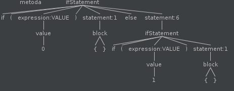

# 构建JVM语言 - Enkel

<h2 align="center">【第十节】：条件语句</h2>

</br>

[原文](http://jakubdziworski.github.io/enkel/2016/04/16/enkel_10_if_statement.html)

</br>

## 源码

这个项目的源码可以从[Github仓库](https://github.com/JakubDziworski/Enkel-JVM-language)中进行克隆。

## 语法变更

显示条件语句将会导致下面的两个语法发生变更：
- 介绍一个新的规则`ifStatement`。
- 在`expression`规则中添加可选的`conditionalExpression`。

```antlr
ifStatement :  'if'  '('? expression ')'? trueStatement=statement ('else' falseStatement=statement)?;
expression : varReference #VARREFERENCE
           | value        #VALUE
           //other expression alternatives
           | expression cmp='>' expression #conditionalExpression
           | expression cmp='<' expression #conditionalExpression
           | expression cmp='==' expression #conditionalExpression
           | expression cmp='!=' expression #conditionalExpression
           | expression cmp='>=' expression #conditionalExpression
           | expression cmp='<=' expression #conditionalExpression
           ;
```

`ifStatement`规则定义基本上意味着：
- `expression`是一个将被测试的条件
- 不需要将条件置于括号（`'('?` `')'?`）中 - 标记的问好意味着可选。
- 条件为true时，将会执行`trueStatement`语句。
- if可以跟在else后面。
- 条件为false时，将会执行`falseStatement`语句。
- `ifStatement`也不是个表达式，所以它可以被用在`trueStatement`和`falseStatement`中（if...else if...else）。

新的表达式几乎可以自解释。它们的目的是为了比较两个表达式并返回另一个表达式（布尔值）。

为了更好的理解“if”和“else”是如何指定“else if”，请看下面的代码段：

```groovy
if(0) {
        
} else if(1) {
        
}
```

上面的代码可以被解析成下面的解析树：



如你所示，第二个if实际上是else的子项。它们在层次结构（hierarchy）中处于不同的位置。这里没有必要在规则中显式地指明“else if”。“ifStatement”规则实际上也是一个陈述句规则，所以其他的ifStatement规则可以在ifStatement规则内使用。这提供了一种轻易连接它们的方法。

## 适配antlr上下文对象

Antlr自动生成`IfStatementContext`对象并将其转换成POJO的`IfStatement`对象。

```java
public class StatementVisitor extends EnkelBaseVisitor<Statement> {
    //other stuff
    @Override
    public Statement visitIfStatement(@NotNull EnkelParser.IfStatementContext ctx) {
        ExpressionContext conditionalExpressionContext = ctx.expression();
        Expression condition = conditionalExpressionContext.accept(expressionVisitor); //Map conditional expression
        Statement trueStatement = ctx.trueStatement.accept(this); //Map trueStatement antlr object
        Statement falseStatement = ctx.falseStatement.accept(this); //Map falseStatement antlr object

        return new IfStatement(condition, trueStatement, falseStatement);
    } 
}
```

在另一方面，条件语句可以像这样适配：

```java
public class ExpressionVisitor extends EnkelBaseVisitor<Expression> {
    @Override
    public ConditionalExpression visitConditionalExpression(@NotNull EnkelParser.ConditionalExpressionContext ctx) {
        EnkelParser.ExpressionContext leftExpressionCtx = ctx.expression(0); //get left side expression ( ex. 1 < 5  -> it would mean get "1")
        EnkelParser.ExpressionContext rightExpressionCtx = ctx.expression(1); //get right side expression
        Expression leftExpression = leftExpressionCtx.accept(this); //get mapped (to POJO) left expression using this visitor
        //rightExpression might be null! Example: 'if (x)' checks x for nullity. The solution for this case is to assign integer 0 to the rightExpr 
        Expression rightExpression = rightExpressionCtx != null ? rightExpressionCtx.accept(this) : new Value(BultInType.INT,"0"); 
        CompareSign cmpSign = ctx.cmp != null ? CompareSign.fromString(ctx.cmp.getText()) : CompareSign.NOT_EQUAL; //if there is no cmp sign use '!=0' by default
        return new ConditionalExpression(leftExpression, rightExpression, cmpSign);
    }
}
```

CompareSign是一个代表比较标志（“==”，“<”等）的对象。它也存储适当的字节码指令（`IF_ICMPEQ`, `IF_ICMPLE`等）以进行比较。

## 生成字节码

jvm有几组用于条件分支的条件指令。

- `if<eq,ne,lt,le,gt,ge>` - 从栈中弹出一个值并将其与0比较。
- `if_icmp_<eq,ne,lt,le,gt,ge>` - 从栈中弹出两个值并让它们互相比较。
- 其他原始类型的if<>（lcmp - long，fcmpg - float等）。
- `if[non]null` - null检查

现在，我们只需要使用第二组。携带操作数的指令是一种分支偏移量（如果满足条件，将继续执行的指令）。

## 生成条件表达式

为了生成字节码，`ifcmpne`（比较两个值是否不等）指令的第一个位置将使用`ConditionalExpression`。

```java
public void generate(ConditionalExpression conditionalExpression) {
    Expression leftExpression = conditionalExpression.getLeftExpression();
    Expression rightExpression = conditionalExpression.getRightExpression();
    Type type = leftExpression.getType();
    if(type != rightExpression.getType()) {
        throw new ComparisonBetweenDiferentTypesException(leftExpression, rightExpression); //not yet supported
    }
    leftExpression.accept(this);
    rightExpression.accept(this);
    CompareSign compareSign = conditionalExpression.getCompareSign();
    Label trueLabel = new Label(); //represents an adress in code (to which jump if condition is met)
    Label endLabel = new Label();
    methodVisitor.visitJumpInsn(compareSign.getOpcode(),trueLabel);
    methodVisitor.visitInsn(Opcodes.ICONST_0);
    methodVisitor.visitJumpInsn(Opcodes.GOTO, endLabel);
    methodVisitor.visitLabel(trueLabel);
    methodVisitor.visitInsn(Opcodes.ICONST_1);
    methodVisitor.visitLabel(endLabel);
}
```

compareSign.getOpcode() - 返回条件指令

```java
public enum CompareSign {
    EQUAL("==", Opcodes.IF_ICMPEQ),
    NOT_EQUAL("!=", Opcodes.IF_ICMPNE),
    LESS("<",Opcodes.IF_ICMPLT),
    GREATER(">",Opcodes.IF_ICMPGT),
    LESS_OR_EQUAL("<=",Opcodes.IF_ICMPLE),
    GRATER_OR_EQAL(">=",Opcodes.IF_ICMPGE);
    //getters
}
```

携带操作数的条件指令是一种分支偏移量（标签）。此刻正在栈的最顶端的两个值被弹出并使用`compareSign.getOpcode()`进行比较。

如果比较结果为正则跳转到true标签中。`trueLabel`指令意味着将整型1压入栈中。

如果比较结果为负，则不执行跳转。而是调用下一条指令（ICONST_0 - 将0压入栈中）。

然后，执行GOTO（无条件分支指令）指令跳转到结束标签上。这样负责条件为正的代码就被绕过了。

使用上述方式执行比较语句将会确保结果是1或0（将被压入栈中的整型值）。

在这种方式中，`conditionExpression`可以被当作表达式使用 - 他可以被分配给变量，传递给函数的参数，打印甚至是充当返回值。

## 生成IfStatement

```java
public void generate(IfStatement ifStatement) {
    Expression condition = ifStatement.getCondition();
    condition.accept(expressionGenrator);
    Label trueLabel = new Label();
    Label endLabel = new Label();
    methodVisitor.visitJumpInsn(Opcodes.IFNE,trueLabel);
    ifStatement.getFalseStatement().accept(this);
    methodVisitor.visitJumpInsn(Opcodes.GOTO,endLabel);
    methodVisitor.visitLabel(trueLabel);
    ifStatement.getTrueStatement().accept(this);
    methodVisitor.visitLabel(endLabel);
}
```

`IfStatement`依赖于`ConditionExpression`使用的概念 - 它确保0或1作为生成的值被压入栈中。

它简单的评估表达式（`condition.accept(expressionGenerator);`）并检测压入栈中的值是否不等于0（`methodVisitor.visitJumpInsn(Opcodes.IFNE,trueLabel);`）。如果不等于0则跳转到`trueLabel`（生成`trueStatement`语句，`ifStatement.getTrueStatement().accept(this);`）。否则继续执行指令，生成`falseStatement`语句并跳转（`GOTO`）到`endLabel`。

## 示例

下列的Enkel类：

```grovvy
SumCalculator {

    main(string[] args) {
        var expected = 8
        var actual = sum(3,5)

        if( actual == expected ) {
            print "test passed"
        } else {
            print "test failed"
        }
    }

    int sum (int x ,int y) {
        x+y
    }
    
}
```

编译后生成如下字节码：

```shell
kuba@kuba-laptop:~/repos/Enkel-JVM-language$ javap -c  SumCalculator
public class SumCalculator {
  public static void main(java.lang.String[]);
    Code:
       0: bipush        8
       2: istore_1          //store 8 in local variable 1 (expected)
       3: bipush        3   //push 3 
       5: bipush        5   //push 5
       7: invokestatic  #10 //Call metod sum (5,3)
      10: istore_2          //store the result in variable 2 (actual)
      11: iload_2           //push the value from variable 2 (actual=8) onto the stack
      12: iload_1           //push the value from variable 1 (expected=8) onto the stack
      13: if_icmpeq     20  //compare two top values from stack (8 == 8) if false jump to label 20
      16: iconst_0          //push 0 onto the stack
      17: goto          21  //go to label 21 (skip true section)
      20: iconst_1          //label 21 (true section) -> push 1 onto the stack
      21: ifne          35  //if the value on the stack (result of comparison 8==8 != 0 jump to label 35
      24: getstatic     #16  // get static Field java/lang/System.out:Ljava/io/PrintStream;
      27: ldc           #18  // push String test failed
      29: invokevirtual #23  // call print Method "Ljava/io/PrintStream;".println:(Ljava/lang/String;)V
      32: goto          43   //jump to end (skip true section)
      35: getstatic     #16                 
      38: ldc           #25  // String test passed
      40: invokevirtual #23                 
      43: return

  public static int sum(int, int);
    Code:
       0: iload_0
       1: iload_1
       2: iadd
       3: ireturn
}
```

</br></br></br>

<div align="left"><a href="./08-返回值.md">上一节</a></div>

<div align="left"><a href="./10-默认参数.md">下一节</a></div>