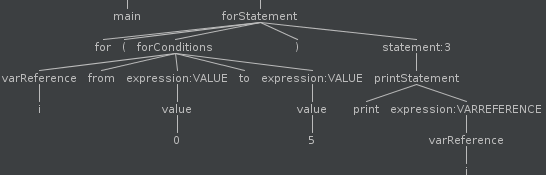

# 构建JVM语言 - Enkel

<h2 align="center">【第十三节】：for循环</h2>

</br>

[原文](http://jakubdziworski.github.io/enkel/2016/04/24/enkel_13_for_loops.html)

</br>

## 源码

这个项目的源码可以从[Github仓库](https://github.com/JakubDziworski/Enkel-JVM-language)中进行克隆。

## 范围循环

在本文中我打算将其描述为“有范围的for循环”。有范围的for循环在指定的范围内迭代值。在Java中for循环看起来像这样：

```java
for (int i=0;i<=5;i++)
```

在Enkel中，下面的表达式与其等价

```groovy
for i from 0 to 5
```

我还实现了一个额外的特性。循环可以感知到它们是否应该增加还是减少。

```groovy
for i from 0 to 5 //increment i from 0 to 5  - for (int i=0;i<=5;i++)

for i from 5 to 0 //decremenet i from 5 to 0 - for (int i=5;i>=0;i--)
```

循环的类型（递增还是递减）必须在运行时推断出来，因为循环的值可能影响函数调用。

while循环和foreach循环（`for (item: collection)`）的概念很相似。为了使这篇文章尽可能简短，就不在这里进行描述了。

## 语法变更

```antlr
statement : block
           //other statement alternatives
           | forStatement ;

forStatement : 'for' ('(')? forConditions (')')? statement ;
forConditions : iterator=varReference  'from' startExpr=expression range='to' endExpr=expression ;
```

- `forCondition`是绑定在迭代器中的条件（`for i from 0 to 10`）。
- 用`=`标记规则是为了增强解析器的可读性。
- 迭代器必须是变量的名称（var关键字可能不在这个范围内存在，这种情况下，变量在后台声明）。
- `startExpression`的值是为了初始化迭代器。
- `endExpression`的值是为了终止迭代器。

对于下面的语句：

```groovy
for (i from 0 to 5) print i
```

 它的解析树如下所示：

 

 ## 适配antlr上下文对象

 antlr从语法规范中生成了ForStatementContext类。将其映射到对编译器友好的类中是一个不错的注意。映射时，为什么不解决上面提到的问题（为定义的迭代器变量）？。


```java
public class ForStatementVisitor extends EnkelBaseVisitor<RangedForStatement> {

    //other stuff
    
    @Override
    public RangedForStatement visitForStatement(@NotNull ForStatementContext ctx) {
        EnkelParser.ForConditionsContext forExpressionContext = ctx.forConditions();
        Expression startExpression = forExpressionContext.startExpr.accept(expressionVisitor);
        Expression endExpression = forExpressionContext.endExpr.accept(expressionVisitor);
        VarReferenceContext iterator = forExpressionContext.iterator;
        String varName = iterator.getText();
        //If variable referenced by iterator already exists in the scope
        if(scope.localVariableExists(varName)) { 
            //register new variable value
            Statement iteratorVariable = new AssignmentStatement(varName, startExpression); 
            //get the statement (usually block))
            Statement statement = ctx.statement().accept(statementVisitor); 
            return new RangedForStatement(iteratorVariable, startExpression, endExpression,statement, varName, scope); 
        //Variable has not been declared in the scope
        } else { 
            //create new local variable and add to the scope
            scope.addLocalVariable(new LocalVariable(varName,startExpression.getType())); 
            //register variable declaration statement
            Statement iteratorVariable = new VariableDeclarationStatement(varName,startExpression); 
            Statement statement = ctx.statement().accept(statementVisitor);
            return new RangedForStatement(iteratorVariable, startExpression, endExpression,statement, varName,scope);
        }
    }
}
```

迭代器变量可能或不可能存在这个范围中。以下两个语句都应该被处理：

```groovy
var iterator = 0
for (iterator from 0 to 5) print iterator
```

迭代器已经被声明。将其分配给`startExpression`（值为0）：`new AssignmentStatement(varName, startExpression);`。

```groovy
for (iterator from 0 to 5) print iterator
```

迭代器未被声明。先声明迭代器后再将其分配给`startExpression`（值为0）：`new VariableDeclarationStatement(varName,startExpression);`。

## 生成字节码

一旦`RangedForStatement`被创建，就应该从其中拉取一些信息并生成字节码。

对于循环操作没有专门的jvm指令与其对应。一种方式是使用控制流（条件的和非条件的）指令（在[第十节：条件语句](./09-条件语句.md)中描述）。

```java
public void generate(RangedForStatement rangedForStatement) {
    Scope newScope = rangedForStatement.getScope();
    StatementGenerator scopeGeneratorWithNewScope = new StatementGenerator(methodVisitor, newScope);
    ExpressionGenrator exprGeneratorWithNewScope = new ExpressionGenrator(methodVisitor, newScope);
    Statement iterator = rangedForStatement.getIteratorVariableStatement();
    Label incrementationSection = new Label();
    Label decrementationSection = new Label();
    Label endLoopSection = new Label();
    String iteratorVarName = rangedForStatement.getIteratorVarName();
    Expression endExpression = rangedForStatement.getEndExpression();
    Expression iteratorVariable = new VarReference(iteratorVarName, rangedForStatement.getType());
    ConditionalExpression iteratorGreaterThanEndConditional = new ConditionalExpression(iteratorVariable, endExpression, CompareSign.GREATER);
    ConditionalExpression iteratorLessThanEndConditional = new ConditionalExpression(iteratorVariable, endExpression, CompareSign.LESS);

    //generates varaible declaration or variable reference (istore)
    iterator.accept(scopeGeneratorWithNewScope);

    //Section below checks whether the loop should be iterating or decrementing
    //If the range start is smaller than range end (i from 0 to 5)  then iterate (++)
    //If the range start is greater than range end (i from 5 to 0) then decrement (--)

    //Pushes 0 or 1 onto the stack 
    iteratorLessThanEndConditional.accept(exprGeneratorWithNewScope);
    //IFNE - is value on the stack (result of conditional) different than 0 (success)?
    methodVisitor.visitJumpInsn(Opcodes.IFNE,incrementationSection);

    iteratorGreaterThanEndConditional.accept(exprGeneratorWithNewScope);
    methodVisitor.visitJumpInsn(Opcodes.IFNE,decrementationSection);

    //Incrementation section
    methodVisitor.visitLabel(incrementationSection);
    rangedForStatement.getStatement().accept(scopeGeneratorWithNewScope); //execute the body
    methodVisitor.visitIincInsn(newScope.getLocalVariableIndex(iteratorVarName),1); //increment iterator
    iteratorGreaterThanEndConditional.accept(exprGeneratorWithNewScope); //is iterator greater than range end?
    methodVisitor.visitJumpInsn(Opcodes.IFEQ,incrementationSection); //if it is not go back loop again 
    //the iterator is greater than end range. Break out of the loop, skipping decrementation section
    methodVisitor.visitJumpInsn(Opcodes.GOTO,endLoopSection); 

    //Decrementation section
    methodVisitor.visitLabel(decrementationSection);
    rangedForStatement.getStatement().accept(scopeGeneratorWithNewScope);
    methodVisitor.visitIincInsn(newScope.getLocalVariableIndex(iteratorVarName),-1); //decrement iterator
    iteratorLessThanEndConditional.accept(exprGeneratorWithNewScope);
    methodVisitor.visitJumpInsn(Opcodes.IFEQ,decrementationSection);

    methodVisitor.visitLabel(endLoopSection);
}
```

这看起来有点复杂，因为在运行时就需要确定循环应该递增还是递减。

让我们一起分析一下在示例`for i from 0 to 5`中，方法是怎样选择正确的迭代类型的。

- 声明迭代器变量`i`并为其赋初始值（`0`）。
- 检查迭代器的值（`0`）是否小于范围终止值（`5`）。
- 由于`0`（范围起始值）小于`5`（范围终止值），所以迭代器需要递增（跳到递增部分）。
- 在循环中执行实际的语句。
- 迭代器按增量`1`递增。
- 检查迭代器的值是否大于终止值（`5`）。
- 如果不满足则返回第四步。
- 一旦循环执行5次（迭代器是6），则（跳过递减部分）转到结束部分。

## 示例

让我们一起编译下面的Enkel类：

```groovy
Loops {
    main(string[] args) {
        for i from 1 to 5 {
            print i
        }
    }
}
```

为了更好的展示它是如何推断迭代类型的，我使用Intellij Idea的反编译器将Enkel.class文件反编译：

```java
//Enkel.class file decompiled to Java using Intellij Idea's decompiler

public class Loops {
    public static void main(String[] var0) {
        int var1 = 1;
        if(var1 >= 5 ) { //should it be decremented?
            do {
                System.out.println(var1);
                --var1;
            } while(var1 >= 5);
        } else { //should it be incremented?
            do {
                System.out.println(var1);
                ++var1;
            } while(var1 <= 5);
        }

    }
}
```

结果是显而易见的：

```shell
kuba@kuba-laptop:~/repos/Enkel-JVM-language$ java Loops 
1
2
3
4
5
```

</br></br></br>

<div align="left"><a href="./11-函数参数命名.md">上一节</a></div>

<div align="left"><a href="./13-处理其他原子类型.md">下一节</a></div>