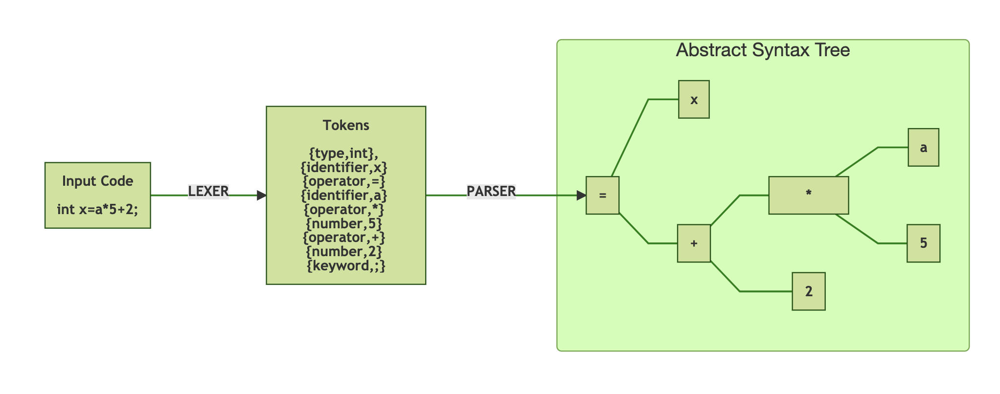

# 构建JVM语言 - Enkel

<h2>【第二节】：最简短的理论</h2>

 

站在抽象的最高层，我需要实现三个模块。

|模块|输入|输出|
|:-:|:-:|:-:|
|Lexer|文本（代码）|Token流|
|Parser|Token流|AST（抽象语法树）|
|Compiler|AST|JVM字节码|

### Lexer（词法分析器）

词法分析器接受简单的文本并将其分词标记化。代码不再是无意义的字节流，而是一个Token流。Token流还有助于进一步分析相关联的类型。

### Parser（语法解析器）

Token流被传递给语法解析器，它负责将Token流组织成被称为抽象语法树的层次结构。这棵树决定着代码将要被执行的顺序。

### Compiler（编译器）

编译器遍历这棵抽象语法书，并将其映射成对应的字节码指令。

## 例子

假设我要执行`int x = a * 5 + 2;`表达式。需要采取以下步骤：

一旦抽象语法树被创建后，它就需要被编译器映射成字节码。