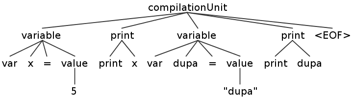

# 构建JVM语言 - Enkel

<h2 align="center">【第三节】：Hello Enkel</h2>

</br>

[原文](http://jakubdziworski.github.io/enkel/2016/03/16/enkel_3_hello_enkel.html)

</br>

## 自顶向下的方式

由于构建一门语言不是一个短暂的任务，在项目的开发期间我将非常依赖自顶向下的方式。我将以最简洁的方式一次性描述所有的模块，而不是面面俱到，分别介绍每个模块的细节。每次迭代后，我都会在项目中添加一些新功能，并对其进行详细说明。

## 源码

这个项目的源码可以从[Github仓库](https://github.com/JakubDziworski/Enkel-JVM-language)中进行克隆。

## 特性

这一节我将会给Enkel语言添加以下特性：

- 用整型（`int`）或字符串类型（`string`）来描述变量
- 打印变量
- 简单的类型引用

因此，让我们从最简洁的实现开始，让Enkel的第一行代码在JVM上运行。这是将在一天结束时执行的代码。

```enk
var five = 5
print five
var dupa = "duap"
print dupa
```

## 使用Antlr4进行词法分析与语法解析

我本来是想从头开始实现一个词法分析器的，但是这似乎看起来是个非常具有重复性的工作。在浏览网页一段时间后我发现了一个很棒的工具交“Antlr”。你只需用描述你的语言规则的类似组织结构的文件来“喂”它，它就会为你提供一种遍历抽象语法树（也叫解析树）的方式。让我们来为Enkel语言创建一个非常简单的规则

```anltr
//header
grammar Enkel;

//parser rules
compilationUnit : ( variable | print )* EOF; //root rule - globally code consist only of variables and prints (see definition below)
variable : VARIABLE ID EQUALS value; //requires VAR token followed by ID token followed by EQUALS TOKEN ...
print : PRINT ID ; //print statement must consist of 'print' keyword and ID
value : NUMBER
      | STRING ; //must be NUMBER or STRING value (defined below)

//lexer rules (tokens)
VARIABLE : 'var' ; //VARIABLE TOKEN must match exactly 'var'
PRINT : 'print' ;
EQUALS : '=' ; //must be '='
NUMBER : [0-9]+ ; //must consist only of digits
STRING : '"'.*'"' ; //must be anything in qutoes
ID : [a-zA-Z0-9]+ ; //must be any alphanumeric value
WS: [ \t\n\r]+ -> skip ; //special TOKEN for skipping whitespaces
```

对于使用者来说最重要的是EnkelBaseListener。当算法遍历树的时候它提供了很棒的回调 - 我们不需要为词法分析器和解析器的类而烦恼 - Antlr这个库帮我们将它们分开了。

在执行`javac *.java`命令编译所有的java类之后，是时候测试这些规则了。Antlr库中有一个非常有用的工具，就是为了这个目的而编写的。它就是`org.antlr.v4.gui.TestRig`：

```shell
$ export CLASSPATH=".:$ANTLR_JAR_LOCATION:$CLASSPATH"
$ java org.antlr.v4.gui.TestRig Enkel compilationUnit -gui
var x=5
print x
var dupa="dupa"
print dupa
ctrl+D //文件结束
```

上面的命令生成的解析树的可视化形式如下所示：



我发现自己也定期使用`-tokens`选项。他打印匹配的标记信息（类型，行号等）。

## 遍历解析树

Antlr提供了一种通过实现`EnkelListener`的子类来遍历（访问）解析树节点的方式：

```java
// EnkelTreeWalkListener.java
public class EnkelTreeWalkListener extends EnkelBaseListener {

    Queue<Instruction> instructionsQueue = new ArrayDeque<>();
    Map<String, Variable> variables = new HashMap<>();

    public Queue<Instruction> getInstructionsQueue() {
        return instructionsQueue;
    }

    @Override
    public void exitVariable(@NotNull EnkelParser.VariableContext ctx) {
        final TerminalNode varName = ctx.ID();
        final EnkelParser.ValueContext varValue = ctx.value();
        final int varType = varValue.getStart().getType();
        final int varIndex = variables.size();
        final String varTextValue = varValue.getText();
        Variable var = new Variable(varIndex, varType, varTextValue);
        variables.put(varName.getText(), var);
        instructionsQueue.add(new VariableDeclaration(var));
        logVariableDeclarationStatementFound(varName, varValue);
    }

    @Override
    public void exitPrint(@NotNull EnkelParser.PrintContext ctx) {
        final TerminalNode varName = ctx.ID();
        final boolean printedVarNotDeclared = !variables.containsKey(varName.getText());
        if (printedVarNotDeclared) {
            final String erroFormat = "ERROR: WTF? You are trying to print var '%s' which has not been declared!!!111. ";
            System.out.printf(erroFormat, varName.getText());
            return;
        }
        final Variable variable = variables.get(varName.getText());
        instructionsQueue.add(new PrintVariable(variable));
        logPrintStatementFound(varName, variable);
    }

    private void logVariableDeclarationStatementFound(TerminalNode varName, EnkelParser.ValueContext varValue) {
        final int line = varName.getSymbol().getLine();
        final String format = "OK: You declared variable named '%s' with value of '%s' at line '%s'.\n";
        System.out.printf(format, varName, varValue.getText(), line);
    }

    private void logPrintStatementFound(TerminalNode varName, Variable variable) {
        final int line = varName.getSymbol().getLine();
        final String format = "OK: You instructed to print variable '%s' which has value of '%s' at line '%s'.'\n";
        System.out.printf(format,variable.getId(),variable.getValue(),line);
    }
}
```

`getInstructionsQueue`按照正确的顺序返回了所有的指令，这些指令将在之后被转换成JVM字节码。

当监听器被实现之后，就到了注册它的时候了：

```java
// SyntaxTreeTraverser.java
public class SyntaxTreeTraverser {
    public Queue<Instruction> getInstructions(String fileAbsolutePath) throws IOException {
        CharStream charStream = new ANTLRFileStream(fileAbsolutePath); //fileAbolutePath - file containing first enk code file
        EnkelLexer lexer = new EnkelLexer(charStream);  //create lexer (pass enk file to it)
        CommonTokenStream tokenStream = new CommonTokenStream(lexer);
        EnkelParser parser = new EnkelParser(tokenStream);
        EnkelTreeWalkListener listener = new EnkelTreeWalkListener(); //EnkelTreeWalkListener extends EnkelBaseLitener - handles parse tree visiting events
        BaseErrorListener errorListener = new EnkelTreeWalkErrorListener(); //EnkelTreeWalkErrorListener - handles parse tree visiting error events

        parser.addErrorListener(errorListener);
        parser.addParseListener(listener);
        parser.compilationUnit(); //compilation unit is root parser rule - start from it!
        return listener.getInstructionsQueue();
    }
}
```

我也写了一个处理错误的简版监听器：

```java
// EnkelTreeWalkErrorListener.java
public class EnkelTreeWalkErrorListener extends BaseErrorListener {
    @Override
    public void syntaxError(Recognizer<?, ?> recognizer, Object offendingSymbol, int line, int charPositionInLine, String msg, RecognitionException e) {
        final String errorFormat = "You fucked up at line %d,char %d :(. Details:\n%s";
        final String errorMsg = String.format(errorFormat, line, charPositionInLine, msg);
        System.out.println(errorMsg);
    }
}
```

解析树的监听器已经实现了。是时候运行`SyntaxTreeTraverser`了。为此，我创建了`Compiler`类，它是编译器的起点。它带有一个参数（要被解析的文件的完整路径）。

```java
//Compiler.java
public class Compiler {

    public static void main(String[] args) throws Exception {
        new Compiler().compile(args);
    }

    public void compile(String[] args) throws Exception {
        //arguments validation skipped (check out full code on github)
        final File enkelFile = new File(args[0]);
        String fileName = enkelFile.getName();
        String fileAbsolutePath = enkelFile.getAbsolutePath();
        String className = StringUtils.remove(fileName, ".enk");
        final Queue<Instruction> instructionsQueue = new SyntaxTreeTraverser().getInstructions(fileAbsolutePath);
        //TODO: generate bytecode based on instructions
    }
}
```

现在我有了一个完全独立的应用程序，可以验证我的*.enk文件。他不会编译或者运行这些文件，但是至少他可以验证下面的这些规则：

- 允许使用像`var x=1`或者`var x="anything"`的语法定义变量。
- 允许使用像`print x`的语法打印变量
- 如果代码语法与上面的规则不匹配则打印错误输出。

让我们一起测试下面的例子`first.enk`吧：

```enk
var five=5
print five   
var dupa="dupa"  
print dupa
```

```shell
$java Compiler first.enk

OK: You declared variable named 'five' with value of '5' at line '1'.
OK: You instructed to print variable '0' which has value of '5' at line '2'.'
OK: You declared variable named 'dupa' with value of '"dupa"' at line '3'.
OK: You instructed to print variable '1' which has value of '"dupa"' at line '4'.'
```

错误监听器也需要能够检测不正确的模式。在打印了一行`void noFunctionsYet()`，编译器打印：

```shell
You fucked up at line 1,char 0 :(. Details:
mismatched input 'void' expecting {<EOF>, 'var', 'print'}
```

## 基于指令队列生成字节码

Java的`.class`文件包含了一系列指令（[JVM规范](https://docs.oracle.com/javase/specs/jvms/se7/html/jvms-6.html)）。每个指令包括：

- 操作码（一个字节）- 指定要完成的操作
- 可选操作数 - 指令输入

示例：`iload 5`（0x15 5）- 从本地变量中加载整型的值，5是本地变量列表中的索引。

指令可以从操作数栈中弹出值，也可以将值压入操作数栈。示例：

```shell
iload 3
iload 2
iadd
```

它将在本地变量列表中的第3项加载整型变量，另一个变量在第2项。这时栈中将包含两个整型变量。在调用iadd操作之后，两个整型值将会被iadd“消费”掉，并且结果会被压入栈中。

## ASM

有一个用于操纵字节码的有用的Java工具叫ASM。它将你和指令字节值分开。你不需要关心指令具体的值（是iload 0x15还是0x16？），也不需要关系如何将它们写入文件中。你只需要记住文件的名字即可 - 它将指令和值对应起来，并自动写入文件中。

## 指令接口

`SyntaxTreeTraverser`在访问树节点时将他们存入`instructionsQueue`中。队列可以存入`Instruction`类型的值。

```java
public interface Instruction {
    void apply(MethodVisitor methodVisitor);
}
```

它（`Instruction`接口）要求每一个实现都需要通过`methodVisitor`（ASM库）对象来执行一些字节码指令。

```java
/Compiler.java
public void compile(String[] args) throws Exception {
    //some lines deleted -> described in previous sections of this post
    final Queue<Instruction> instructionsQueue = new SyntaxTreeTraverser().getInstructions(fileAbsolutePath);
    final byte[] byteCode = new BytecodeGenerator().generateBytecode(instructionsQueue, className);
    saveBytecodeToClassFile(fileName, byteCode);
}
//ByteCodeGenerator.java
public class BytecodeGenerator implements Opcodes {
    public byte[] generateBytecode(Queue<Instruction> instructionQueue, String name) throws Exception {

        ClassWriter cw = new ClassWriter(0);
        MethodVisitor mv;
               //version ,      acess,       name, signature, base class, interfaes
        cw.visit(52, ACC_PUBLIC + ACC_SUPER, name, null, "java/lang/Object", null);
        {
            //declare static void main
            mv = cw.visitMethod(ACC_PUBLIC + ACC_STATIC, "main", "([Ljava/lang/String;)V", null, null);
            final long localVariablesCount = instructionQueue.stream()
                    .filter(instruction -> instruction instanceof VariableDeclaration)
                    .count();
            final int maxStack = 100; //TODO - do that properly

            //apply instructions generated from traversing parse tree!
            for (Instruction instruction : instructionQueue) {
                instruction.apply(mv);
            }
            mv.visitInsn(RETURN); //add return instruction

            mv.visitMaxs(maxStack, (int) localVariablesCount); //set max stack and max local variables
            mv.visitEnd();
        }
        cw.visitEnd();

        return cw.toByteArray();
    }
}  
```

因为Enkel（目前）还不支持方法，类或作用域，所以编译后的类是Object类的子类，它只有main方法。我需要指定本地变量的大小和栈的最大大小。然后每条指定都会在循环中向字节码添加一些内容。目前这里有两种类型的字节码：

```java
// VariableDeclaration.java
public class VariableDeclaration implements Instruction,Opcodes {
    Variable variable;

    public VariableDeclaration(Variable variable) {
        this.variable = variable;
    }

    @Override
    public void apply(MethodVisitor mv) {
        final int type = variable.getType();
        if(type == EnkelLexer.NUMBER) {
            int val = Integer.valueOf(variable.getValue());
            mv.visitIntInsn(BIPUSH,val);
            mv.visitVarInsn(ISTORE,variable.getId());
        } else if(type == EnkelLexer.STRING) {
            mv.visitLdcInsn(variable.getValue());
            mv.visitVarInsn(ASTORE,variable.getId());
        }
    }
}
```

值得主意的是，这里已经实现了一小部分的类型推断。类型在解析文件的过程中，基于词法分析的标记（token）被动态的推导出来！多亏了这一点，我可以根据类型执行不同的指令：

- `visitInsn` - 访问指令 - 第一个参数是（指令的）操作码，第一个参数是操作数

- `BIPUSH` - 将一个（整型）字节值压入栈中
- `ISTORE` 将整型存入本地变量中。它带了一个本地变量的索引作为操作数。它将整型从栈中弹出。
- `ASTORE` - 和`ISTORE`一样，但是“A”表示引用（非常直观）。它需要作为一个引用被存起来，因为Strinig实例是一个对象。

第二个指令类型：

```java
// PrintVariable.java
public class PrintVariable implements Instruction, Opcodes {
    public PrintVariable(Variable variable) {
        this.variable = variable;
    }

    @Override
    public void apply(MethodVisitor mv) {
        final int type = variable.getType();
        final int id = variable.getId();
        mv.visitFieldInsn(GETSTATIC, "java/lang/System", "out", "Ljava/io/PrintStream;");
        if (type == EnkelLexer.NUMBER) {
            mv.visitVarInsn(ILOAD, id);
            mv.visitMethodInsn(INVOKEVIRTUAL, "java/io/PrintStream", "println", "(I)V", false);
        } else if (type == EnkelLexer.STRING) {
            mv.visitVarInsn(ALOAD, id);
            mv.visitMethodInsn(INVOKEVIRTUAL, "java/io/PrintStream", "println", "(Ljava/lang/String;)V", false);
        }
    }
}
```

- `GETSTATIC` - 从类中获取静态变量（`java.lang.System。out`的字段类型是`java.io.PrintStream`）
- `ILOAD` - 将本地变量压入栈中（id是变量在变量栈中的索引）
- `visitMethodInsn` - 访问一个方法指令
- `INVOKEVIRTUAL` - 触发实例的一个方法（调用out字段println方法，该方法携带了一个整型输入并访问void类型）
- `ALOAD` - 和`ILOAD`一样，但是A代表引用（String对象的引用）

## 生成字节码

在调用cw.toByteArray()后，ASM创建了一个新的`ByteVector` 实例，并将所有的指令都放入该实例中。在**所有**.class文件中，前四个字节都是**0xCAFEBABE**。之后的值描述如下：

```java
// https://docs.oracle.com/javase/specs/jvms/se8/html/jvms-4.html#jvms-4.1
ClassFile {
    u4             magic; //CAFEBABE
    u2             minor_version;
    u2             major_version;
    u2             constant_pool_count;
    cp_info        constant_pool[constant_pool_count-1]; //string constants etc...
    u2             access_flags;
    u2             this_class;
    u2             super_class;
    u2             interfaces_count;
    u2             interfaces[interfaces_count];
    u2             fields_count;
    field_info     fields[fields_count];
    u2             methods_count;
    method_info    methods[methods_count];
    u2             attributes_count;
    attribute_info attributes[attributes_count];
}
```

## 将字节码写入文件

这里需要提一下JVM规范 - .class文件名必须和类名保持一致。传递给编译器的文件是一个“类”名，所以输出必须和它一样，但是扩展名不同（*.enk -> *.class）:

```java
// Compiler.java
private static void saveBytecodeToClassFile(String fileName, byte[] byteCode) throws IOException {
      final String classFile = StringUtils.replace(fileName, ".enk", ".class");
      OutputStream os = new FileOutputStream(classFile);
      os.write(byteCode);
      os.close();
}
```

## 校验.class文件

为了测试结果，一个好的主意是使用一些可以分析字节码的工具。如今，针对每个现代的Java开发工具都有很多这种插件。你可以选择javap工具（捆绑在jdk中）：

```txt
$ $JAVA_HOME/bin/javap -v file

Classfile /home/kuba/repos/Enkel-JVM-language/file.class
  Last modified 2016-03-16; size 335 bytes
  MD5 checksum bcbdaa7e7389167342e0c04b52951bc9
public class file
  minor version: 0
  major version: 52
  flags: ACC_PUBLIC, ACC_SUPER
Constant pool:
   #1 = Utf8               file
   #2 = Class              #1             // file
   #3 = Utf8               java/lang/Object
   #4 = Class              #3             // java/lang/Object
   #5 = Utf8               Test.java
   #6 = Utf8               main
   #7 = Utf8               ([Ljava/lang/String;)V
   #8 = Utf8               java/lang/System
   #9 = Class              #8             // java/lang/System
  #10 = Utf8               out
  #11 = Utf8               Ljava/io/PrintStream;
  #12 = NameAndType        #10:#11        // out:Ljava/io/PrintStream;
  #13 = Fieldref           #9.#12         // java/lang/System.out:Ljava/io/PrintStream;
  #14 = Utf8               java/io/PrintStream
  #15 = Class              #14            // java/io/PrintStream
  #16 = Utf8               println
  #17 = Utf8               (I)V
  #18 = NameAndType        #16:#17        // println:(I)V
  #19 = Methodref          #15.#18        // java/io/PrintStream.println:(I)V
  #20 = Utf8               \"dupa\"
  #21 = String             #20            // \"dupa\"
  #22 = Utf8               (Ljava/lang/String;)V
  #23 = NameAndType        #16:#22        // println:(Ljava/lang/String;)V
  #24 = Methodref          #15.#23        // java/io/PrintStream.println:(Ljava/lang/String;)V
  #25 = Utf8               Code
  #26 = Utf8               SourceFile
{
  public static void main(java.lang.String[]);
    descriptor: ([Ljava/lang/String;)V
    flags: ACC_PUBLIC, ACC_STATIC
    Code:
      stack=2, locals=3, args_size=1
         0: bipush        5
         2: istore_0
         3: getstatic     #13                 // Field java/lang/System.out:Ljava/io/PrintStream;
         6: iload_0
         7: invokevirtual #19                 // Method java/io/PrintStream.println:(I)V
        10: ldc           #21                 // String \"dupa\"
        12: astore_1
        13: getstatic     #13                 // Field java/lang/System.out:Ljava/io/PrintStream;
        16: aload_1
        17: invokevirtual #24                 // Method java/io/PrintStream.println:(Ljava/lang/String;)V
        20: return
}
```

## 运行最开始的Enkel代码

最后，来一起测试一下代码本身：

```enk
var five=5
print five   
var dupa="dupa"  
print dupa 
```

```shell
$java Compiler first.enk
$java first
5
"dupa"
```