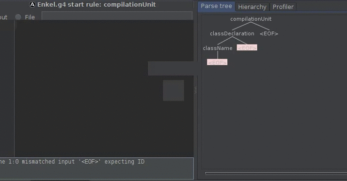

# 构建JVM语言 - Enkel

<h2 align="center">【第五节】：添加类的作用域</h2>

</br>

[原文](http://jakubdziworski.github.io/enkel/2016/03/23/enkel_5_classes.html)

</br>

## 源码

这个项目的源码可以从[Github仓库](https://github.com/JakubDziworski/Enkel-JVM-language)中进行克隆。

## 解析规则变更

在前一篇文章中我提到，Enkel语言中将会添加一些特性。第一个添加的特性很明显是类的作用域。

Enkel语言的解析规则做了如下修改：

```antlr
compilationUnit : ( variable | print )* EOF;
variable : VARIABLE ID EQUALS value;
```

已经变成了

```antlr
compilationUnit : classDeclaration EOF ; //root rule - our code consist consist only of variables and prints (see definition below)
classDeclaration : className '{' classBody '}' ;
className : ID ;
classBody :  ( variable | print )* ;
```

- 文件中将仅包含一个类的声明。
- 类的声明由类名组成，后跟花括号中的主体。
- 类的主体和原型中的使用方式一样 - 变量声明或打印

这就是修改后的生成的解析树：



## 编译器变更

主要的变更就是将上层代码从`ByteCodeGenerator`类中移到`CompilationUnit`和`ClassDeclaration`中。其中的逻辑如下：

1. 编译器从`SyntaxParseTreeTraverser`中捕获解析树的值。
2. 编译器实例化CompilationUnit：
```java
// Compiler.java
final CompilationUnit compilationUnit = new SyntaxTreeTraverser().getCompilationUnit(fileAbsolutePath);
//Check getCompilationUnit() method body on github
```
3. CompilationUnit实例化ClassDeclaration（解析类名和指令列表）
4. ClassDeclaration执行类的特定指令并在ClassScopeInstructions上循环：
```java
// ClassDeclaration.java
 MethodVisitor mv = classWriter.visitMethod(ACC_PUBLIC + ACC_STATIC, "main", "([Ljava/lang/String;)V", null, null);
 instructions.forEach(classScopeInstruction -> classScopeInstruction.apply(mv));
```


一个额外的变更是输出的.class文件名将会基于类的声明而不是*.enk的文件名。


</br></br></br>

<div align="left"><a href="./03-设计Enkel语言的特性.md">上一节</a></div>

<div align="left"><a href="./05-切换到面向访问器的解析.md">下</a></div>