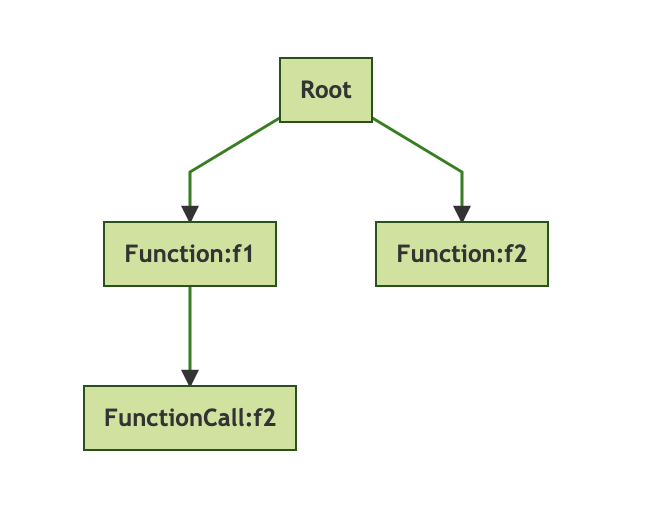

# 构建JVM语言 - Enkel

<h2 align="center">【第七节】：方法</h2>

</br>

[原文](http://jakubdziworski.github.io/enkel/2016/04/05/enkel_7_methods.html)

</br>

## 源码

这个项目的源码可以从[Github仓库](https://github.com/JakubDziworski/Enkel-JVM-language)中进行克隆。

## 方法

迄今为止，在全局作用域内可以定义类和变量了。下一步就是创建方法了。

目标是编译下面的Enkel类：

```groovy
First {
    void main (string[] args) {
        var x = 25
        metoda(x)
    }

    void metoda (int param) {
        print param
    }
}
```

## 作用域

访问其他的函数和变量需要在作用域内：

```java
public class Scope {
    private List<Identifier> identifiers; //think of it as a variables for now
    private List<FunctionSignature> functionSignatures;
    private final MetaData metaData;  //currently stores only class name

    public Scope(MetaData metaData) {
        identifiers = new ArrayList<>();
        functionSignatures = new ArrayList<>();
        this.metaData = metaData;
    }

    public Scope(Scope scope) {
        metaData = scope.metaData;
        identifiers = Lists.newArrayList(scope.identifiers);
        functionSignatures = Lists.newArrayList(scope.functionSignatures);
    }
    
    //some other methods that expose data to the outside
}         
```

作用域对象在类的创建过程中被创建并被传递到子类（的函数）中。子类复制作用域（用其中一个构造函数）并在其中添加其他的项。

## 函数签名

当调用一个方法时需要知道关于它的可用性的一些信息。假设你有以下的伪代码：

```groovy
f1() {
    f2()
}

f2(){
}
```

生成的解析树如下所示：



访问的节点顺序如下：

- Root
- Function:f1
- FunctionCall:f2 // 错误！f2？，这是什么？它还没定义呢
- Function:f2

所以这里存在一个问题：在调用方法时，方法可能还没有被（解析器）访问到。在解析f1时，没有关于f2的信息。

为了解决这个问题，需要强制地（mandatory）访问所有的函数声明，并将它们的签名存在作用域内：

```java
public class ClassVisitor extends EnkelBaseVisitor<ClassDeclaration> {

 private Scope scope;

 @Override
 public ClassDeclaration visitClassDeclaration(@NotNull EnkelParser.ClassDeclarationContext ctx) {
     String name = ctx.className().getText();
     FunctionSignatureVisitor functionSignatureVisitor = new FunctionSignatureVisitor();
     List<EnkelParser.FunctionContext> methodsCtx = ctx.classBody().function();
     MetaData metaData = new MetaData(ctx.className().getText());
     scope = new Scope(metaData);
     //First find all signatures
     List<FunctionSignature> signatures = methodsCtx.stream()
             .map(method -> method.functionDeclaration().accept(functionSignatureVisitor))
             .peek(scope::addSignature)
             .collect(Collectors.toList());
     //Once the signatures are found start parsing methods
     List<Function> methods = methodsCtx.stream()
             .map(method -> method.accept(new FunctionVisitor(scope)))
             .collect(Collectors.toList());
     return new ClassDeclaration(name, methods);
 }
}
```

## Invokestatic

一旦关于代码的所有信息都被解析到后就可以将其转化为字节码了。由于我还没有实现如何创建对象，所以方法需要在静态的上下文中被调用。

```java
int access = Opcodes.ACC_PUBLIC + Opcodes.ACC_STATIC;
```

调用静态方法的字节码指令被称为`invokestatic`。这个指令需要两个参数：

- 存在方法的类的[字段修饰符](https://docs.oracle.com/javase/specs/jvms/se8/html/jvms-4.html#jvms-4.3.2)（Ljava/io/PrintStream;）
- [方法修饰符](https://docs.oracle.com/javase/specs/jvms/se8/html/jvms-4.html#jvms-4.3.3)（example: println:(I)V）

假定操作数栈中的值是参数（数量和类型必须与方法修饰符相匹配）。

```java
public class MethodGenerator {
    private final ClassWriter classWriter;

    public MethodGenerator(ClassWriter classWriter) {
        this.classWriter = classWriter;
    }

    public void generate(Function function) {
        Scope scope = function.getScope();
        String name = function.getName();
        String description = DescriptorFactory.getMethodDescriptor(function);
        Collection<Statement> instructions = function.getStatements();
        int access = Opcodes.ACC_PUBLIC + Opcodes.ACC_STATIC;
        MethodVisitor mv = classWriter.visitMethod(access, name, description, null, null);
        mv.visitCode();
        StatementGenerator statementScopeGenrator = new StatementGenerator(mv);
        instructions.forEach(instr -> statementScopeGenrator.generate(instr,scope));
        mv.visitInsn(Opcodes.RETURN);
        mv.visitMaxs(-1,-1); //asm autmatically calculate those but the call is required
        mv.visitEnd();
    }
}
```

## 结果

下面的Enkel代码：

```groovy
First {
    void main (string[] args) {
        var x = 25
        metoda(x)
    }

    void metoda (int param) {
        print param
    }
}
```

被编译成如下字节码：

```shell
kuba@kuba-laptop:~/repos/Enkel-JVM-language$ javap -c First
public class First {
  public static void main(java.lang.String[]);
    Code:
       0: bipush        25 //push value 25 onto the stack
       2: istore_0         //store value from stack into variable at index 0
       3: iload_0          //load variable at index onto the stack
       5: invokestatic  #10 //call metod Method metoda:(I)V  
       8: return

  public static void metoda(int);
    Code:
       0: getstatic     #16                 // Field java/lang/System.out:Ljava/io/PrintStream;
       3: iload_0
       4: invokevirtual #20                 // Method "Ljava/io/PrintStream;".println:(I)V
       7: return
}
```

</br></br></br>

<div align="left"><a href="./05-切换到面向访问器的解析.md">上一节</a></div>

<div align="left"><a href="./06-方法.md">下一节</a></div>