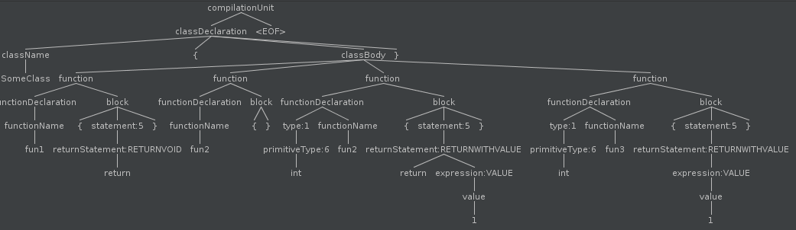

# 构建JVM语言 - Enkel

<h2 align="center">【第九节】：返回值</h2>

</br>

[原文](http://jakubdziworski.github.io/enkel/2016/04/14/enkel_9_return.html)

</br>

## 源码

这个项目的源码可以从[Github仓库](https://github.com/JakubDziworski/Enkel-JVM-language)中进行克隆。

## 语法变更

我定义了一个新的规则叫“returnStatement”。

你可能会疑惑为什么它不叫“returnExpression”呢？毕竟所有的表达式都是一种求值语句（在[上一篇文章](./07-算数运算.md)中提到）。难道返回值语句不是求值语句吗？

这看起来可能让人十分疑惑，但这也表明返回值语句并不是求值表达式。在下面的Java代码中，这种表示（`int x = return 5;`）是没有意义的。在Enkel中，同样如此。换句话说，表达式是可以将值分配给变量的语句。这就是为什么返回值语句是陈述句而不是表达式语句。

```antlr
statement : variableDeclaration
           //other statements rules
           | returnStatement ;

variableDeclaration : VARIABLE name EQUALS expression;
printStatement : PRINT expression ;
returnStatement : 'return' #RETURNVOID
                | ('return')? expression #RETURNWITHVALUE;
```

返回值语句有两个版本：
- RETURNVOID - 在返回void的方法中使用。不需要携带表达式，需要return关键字。
- RETURNWITHVALUE - 在返回非void值的方法中使用。需要携带表达式，return关键字是可选的。

可以显式或隐式的返回值。

```groovy
SomeClass {
    fun1 {
       return  // 显式的返回void
    }
    
    fun2 {
        // 隐式的返回void
    }
    
    int fun2 {
        return 1  // 显式的返回1
    }
    
    int fun3 {
        1  // 隐式的返回1
    }
}
```

上面的代码可以生成下面的解析树：



你可能注意到解析器在fun2函数中并没有解决隐式返回的问题。这是因为事实上该代码块是空的，而将空的代码块作为返回值语句不是一个好主意。缺少的return语句将会在字节码生成阶段添加回来。

## 适配antlr上下文对象

解析后返回值语句在antlr上下文类中被转换成为POJO的`ReturnStatement`对象。目的是为了在这一步仅提供编译器生成字节码所需要的数据。从antlr生成的对象中获取数据去生成字节码可能会导致难以理解的不可读的代码。

```java
public class StatementVisitor extends EnkelBaseVisitor<Statement> {

    //other stuff
    
    @Override
    public Statement visitRETURNVOID(@NotNull EnkelParser.RETURNVOIDContext ctx) {
        return new ReturnStatement(new EmptyExpression(BultInType.VOID));
    }
    
    @Override
    public Statement visitRETURNWITHVALUE(@NotNull EnkelParser.RETURNWITHVALUEContext ctx) {
        Expression expression = ctx.expression().accept(expressionVisitor); 
        return new ReturnStatement(expression);
    }   
}
```

## 检测隐式的void返回

如果这里有一个从void函数中隐式的返回时，在解析阶段不会检测到任何return语句。这就是为什么有必要检测这种设想（scenario）并在生成阶段添加return语句的原因

```java
public class MethodGenerator {
    //other stuff
    private void appendReturnIfNotExists(Function function, Block block,StatementGenerator statementScopeGenrator) {
        Statement lastStatement = block.getStatements().get(block.getStatements().size() - 1);
        boolean isLastStatementReturn = lastStatement instanceof ReturnStatement;
        if(!isLastStatementReturn) {
            EmptyExpression emptyExpression = new EmptyExpression(function.getReturnType());
            ReturnStatement returnStatement = new ReturnStatement(emptyExpression);
            returnStatement.accept(statementScopeGenrator);
        }
    }
}
```

这个方法将会检测函数的最后一个语句是否是ReturnStatement。如果不是，将会生成return指令。

## 生成字节码

```java
public class StatementGenerator {
    //oher stuff
    public void generate(ReturnStatement returnStatement) {
        Expression expression = returnStatement.getExpression();
        Type type = expression.getType();
        expression.accept(expressionGenrator); //generate bytecode for expression itself (puts the value of expression onto the stack)
        if(type == BultInType.VOID) {
            methodVisitor.visitInsn(Opcodes.RETURN);
        } else if (type == BultInType.INT) {
            methodVisitor.visitInsn(Opcodes.IRETURN);
        }
    }
}
```

例如：`return 5`语句将会导致下述步骤：
- 从ReturnStatement中获取表达式（“5” - 是一种值类型 - 在解析的过程中会被扣除（deducted））
- 为表达式`5`生成字节码（`exxpression.accept(expressionGenerator) `调用`ExpressionGenerator.generate(Value value)` - 访问器模式）。
- 字节码生成的结果是导致一个新的值（5）被压入操作数栈。
- IRETURN指令调用从操作数栈中弹出一个值并将其返回。

`return 5`语句生成的字节码是：

```shell
bipush    5
ireturn
```

## 示例

下列的Enkel的类：

```groovy
SumCalculator {

    main(stirng[] args) {
        print sum(5,2)
    }

    int sum (int x ,int y) {
        x+y
    }
}
```

被编译成下面的字节码：

```shell
kuba@kuba-laptop:~/repos/Enkel-JVM-language$ javap -c  SumCalculator
public class SumCalculator {
  public static void main(java.lang.String[]);
    Code:
       0: getstatic     #12                 //get static field java/lang/System.out:Ljava/io/PrintStream;
       3: bipush        5
       5: bipush        2
       7: invokestatic  #16                 // call method sum (with the values on operand stack 5,2)
      10: invokevirtual #21                 // call method println (with the value on stack - the result of method sum)
      13: return                           //return

  public static int sum(int, int);
    Code:
       0: iload_0
       1: iload_1
       2: iadd
       3: ireturn //return the value from operand stack (result of iadd)
}
```

</br></br></br>

<div align="left"><a href="./07-算数运算.md">上一节</a></div>

<div align="left"><a href="./08-返回值.md">下一节</a></div>