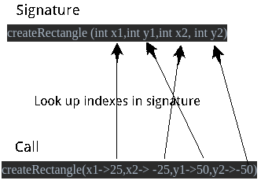

# 构建JVM语言 - Enkel

<h2 align="center">【第十二节】：函数参数命名</h2>

</br>

[原文](http://jakubdziworski.github.io/enkel/2016/04/16/enkel_10_if_statement.html)

</br>

## 为什么我需要命名参数？

像大多数语言一样，Java中的方法调用参数靠索引标识。对于参数数量少，尤其是参数类型不同的方法，这似乎是合理的。不幸的是，有许多方法既没有少量参数，也没有不同的类型的参数。

如果你你曾经做过一些游戏编程，那么你可能会遇到像这样的方法：

```java
Rect createRectangle(int x1,int y1,int x2, int y2) //createRectangle signature
```

我非常确定你至少有一次以错误的参数顺序来调用这个方法。

看到问题了吗？该函数有大量相同类型的参数。很容易忘记参数的顺序 - 只要类型匹配，编译器就不会在意。

如果你可以显式指定参数而不依赖于索引，那岂不是很棒吗？这是为什么我们需要命名参数。

```java
createRectangle(25,50,-25,-50) //method invokation without named parameters :(
createRectangle(x1->25,x2->-25,y1->50,y2->-50) //method invokation with named parameters :)
```

使用命名参数的好处是：

- 参数的顺序是不受限的
- 代码更具有可读性
- 不需要在多个文件之间横跳来比较它们的签名

## 语法变更

```antlr
functionCall : functionName '('argument? (',' argument)* ')';
argument : expression              //unnamed argument
         | name '->' expression   ; //named argument
```

函数调用可以有一个或多个参数（用‘,’分隔）。`argument`规则有两种形式：命名和未命名的。不支持两种形式的混用。

## 参数重排

正如[第七节：方法](./06-方法.md)中所说，方法的解析分为两个步骤。首先是寻找所有的签名（定义），一旦完成则开始解析主体。它确保在解析方法主体的过程中，所有的签名都是可用的。

利用该特征，其思想是通过从签名中获取参数索引，将命名调用转换为未命名调用。

- 在函数签名中，寻找与（函数调用）参数名称相匹配的（函数签名）参数名称
- 获取参数索引
- 如果（函数调用）参数与（函数签名）参数的索引不同，则重新排序。



在上面例子中，x2将与y1交换。

```java
public class ExpressionVisitor extends EnkelBaseVisitor<Expression> {
    //other stuff
    @Override
    public Expression visitFunctionCall(@NotNull EnkelParser.FunctionCallContext ctx) {
        String funName = ctx.functionName().getText();
        FunctionSignature signature = scope.getSignature(funName); 
        List<EnkelParser.ArgumentContext> argumentsCtx = ctx.argument();
        //Create comparator that compares arguments based on their index in signature
        Comparator<EnkelParser.ArgumentContext> argumentComparator = (arg1, arg2) -> {
            if(arg1.name() == null) return 0; //If the argument is not named skip
            String arg1Name = arg1.name().getText();
            String arg2Name = arg2.name().getText();
            return signature.getIndexOfParameter(arg1Name) - signature.getIndexOfParameter(arg2Name);
        };
        List<Expression> arguments = argumentsCtx.stream() //parsed arguments (wrong order)
                .sorted(argumentComparator) //Order using created comparator
                .map(argument -> argument.expression().accept(this)) //Map parsed arguments into expressions
                .collect(toList());
        return new FunctionCall(signature, arguments);
    }
}
```

使用这种方式，负责字节码生成的组件不会区分已命名和未命名的参数。它仅将FunctionCall视为（正确排序的）参数和签名的集合。因此不需要修改字节码生成。

## 示例

下面Enkel类：

```groovy
NamedParamsTest {

    main(string[] args) {
        createRect(x1->25,x2->-25,y1->50,y2->-50)
    }

    createRect (int x1,int y1,int x2, int y2) {
        print "Created rect with x1=" + x1 + " y1=" + y1 + " x2=" + x2 + " y2=" + y2
    }
}
```

编译后生成的字节码如下所示：

```shell
kuba@kuba-laptop:~/repos/Enkel-JVM-language$ javap -c NamedParamsTest.class 
public class NamedParamsTest {
  public static void main(java.lang.String[]);
    Code:
       0: bipush        25          //x1 (1 index in call)
       2: bipush        50          //y1 (3 index in call)
       4: bipush        -25         //x2 (2 index in call)
       6: bipush        -50         //y2 (4 index in call)
       8: invokestatic  #10                 // Method createRect:(IIII)V
      11: return

  public static void createRect(int, int, int, int);
    Code:
      //normal printing code 
}
```

如你所见，y1和x2参数已按预期进行了交换。

输出如下：

```plain
Created rect with x1=25 y1=50 x2=-25 y2=-50
```

</br></br></br>

<div align="left"><a href="./10-默认参数.md">上一节</a></div>

<div align="left"><a href="./11-函数参数命名.md">下一节</a></div>