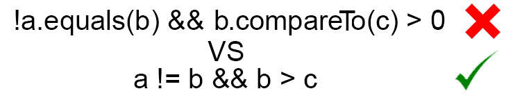

# 构建JVM语言 - Enkel

<h2 align="center">【第十九节】：用操作符取代equals和compareTo函数</h2>

</br>

[原文](http://jakubdziworski.github.io/enkel/2016/05/16/enkel_19_equals_compare_to_operators.html)

</br>



## 源码

这个项目的源码可以从[Github仓库](https://github.com/JakubDziworski/Enkel-JVM-language)中进行克隆。

## 在Java中比较对象

对于新手来说，Java中最令人惊讶的一部分就是比较对象。直接深入代码没有任何的理论背景，有人可能会发现自己被比较的结果弄的很迷惑。

此外，有些陷阱会使整个概念模糊不清。让我们看一个示例：

```java
Integer a = 15;
Integer b = 15;
boolean areEqual = a == b;
```

这里有一个隐式装箱`Integer.valueOf(15)`，它将会返回一个被缓存了的Integer对象。因为是同一个引用，所以areEqual为true。

在执行了上面的代码之后，Java初级程序员可能会想：
- “太棒了，我可以使用`==`来比较对象”

等到第二天他决定换一个值：

```java
Integer a = 155;
Integer b = 155;
boolean areEqual = a == b;
```

但是突然之间（all of the sudden）areEqual为false，因为155已经超过了缓存的范围了。

字符串类型也是个陷阱。如果你通过显式的调用new来创建一个字符串，你会得到一个新的引用。如果你分配一个字符串值给变量（通过双引号），你会得到一个对象池中的对象。

问题是大多数时间（我是说99%的时间）我们都对对象之间的比较关系感兴趣，而不是引用值。我是真的希望`==`是指比较关系上的等于，`<`，`>`，`<=`，`>=`会调用compareTo函数。

与其寄希望于他人，不如自己实现这个特性。

## 为ConditionalExpression实现字节码生成

在[构建JVM语言 - 第十节：条件语句](./09-条件语句.md)中，我引入了一种比较原子类型的方法。这篇文章将会描述比较操作符是怎么样创建的。唯一需要修改的地方就是字节码生成这一步。

首先我们需要检查值是原子类型还是引用类型。如果对象是引用类型，则equals或compareTo方法调用将会生成：

```java
public class ConditionalExpressionGenerator {
     
    //Constructor and fields

    public void generate(ConditionalExpression conditionalExpression) {
        Expression leftExpression = conditionalExpression.getLeftExpression();
        Expression rightExpression = conditionalExpression.getRightExpression();
        CompareSign compareSign = conditionalExpression.getCompareSign();
        if (conditionalExpression.isPrimitiveComparison()) {
            generatePrimitivesComparison(leftExpression, rightExpression, compareSign);
        } else {
            generateObjectsComparison(leftExpression, rightExpression, compareSign);
        }
        Label endLabel = new Label();
        Label trueLabel = new Label();
        methodVisitor.visitJumpInsn(compareSign.getOpcode(), trueLabel);
        methodVisitor.visitInsn(Opcodes.ICONST_0);
        methodVisitor.visitJumpInsn(Opcodes.GOTO, endLabel);
        methodVisitor.visitLabel(trueLabel);
        methodVisitor.visitInsn(Opcodes.ICONST_1);
        methodVisitor.visitLabel(endLabel);
    }

    private void generateObjectsComparison(Expression leftExpression, Expression rightExpression, CompareSign compareSign) {
        Parameter parameter = new Parameter("o", new ClassType("java.lang.Object"), Optional.empty()); // #1 
        List<Parameter> parameters = Collections.singletonList(parameter);
        Argument argument = new Argument(rightExpression, Optional.empty());
        List<Argument> arguments = Collections.singletonList(argument);
        switch (compareSign) { // #2
            case EQUAL:
            case NOT_EQUAL:
                FunctionSignature equalsSignature = new FunctionSignature("equals", parameters, BultInType.BOOLEAN); // #3
                FunctionCall equalsCall = new FunctionCall(equalsSignature, arguments, leftExpression);
                equalsCall.accept(expressionGenerator); // #4
                methodVisitor.visitInsn(Opcodes.ICONST_1); 
                methodVisitor.visitInsn(Opcodes.IXOR); // #5
                break;
            case LESS:
            case GREATER:
            case LESS_OR_EQUAL:
            case GRATER_OR_EQAL:
                FunctionSignature compareToSignature = new FunctionSignature("compareTo", parameters, BultInType.INT); // #6
                FunctionCall compareToCall = new FunctionCall(compareToSignature, arguments, leftExpression);
                compareToCall.accept(expressionGenerator);
                break;
        }
    }

    private void generatePrimitivesComparison(Expression leftExpression, Expression rightExpression, CompareSign compareSign) {
        leftExpression.accept(expressionGenerator);
        rightExpression.accept(expressionGenerator);
        methodVisitor.visitInsn(Opcodes.ISUB); 
    }
}
```

这里有几点值得解释一下：

#### #1

Equals方法定义在Object类中，如下所示：

```java
public boolean equals(Object obj) {
    return (this == obj);
}
```

因此参数需要是`java.lang.Object`类型。名称无关紧要（`o`看起来就很好）。这里没有默认值（`Optional.empty`）

#### #2

强制区分使用的是等于（`==`或`!=`）操作还是比较操作（`>`,`<`，`>=`，`<=`）。我们可以对等于操作也使用`compareTo`但是不是所有的类都实现了`comparable`接口。

#### #3

需要指出equals方法名称为“equals”，只有一个参数，类型为`java.lang.Object`并且返回值为原子类型的`boolean`值。

#### #4

生成负责调用equals方法的字节码。更多详情请查看`CallExpressionGenerator`类。

#### #5

如果对象相等，equals返回true（1）否则返回false（0）。原子类型的等于是用另一种方式计算的。这些值彼此相减。如果结果为0则相等否则不等。为了兼容这些事，false需要和true进行交换。因此我是用XOR指令。从另一方面看，compareTo和原子类型的比较很像。如果相等则返回0，所以这里不需要做任何变更。

#### #6

创建代表`compareTo`的调用。compareTo是在范型之前引入的，因此它也将`java.lang.Object`作为参数，但是返回int类型。

## 示例

下面的Enkel类：

```groovy
EqualitySyntax {

 start {
    var a = new java.lang.Integer(455)
    var b = new java.lang.Integer(455)
    print a == b
    print a > b
 }
}
```

反编译成Java代码和下面类似：

```java
public class EqualitySyntax {
    public void start() {
        Integer var1 = new Integer(455);
        Integer var2 = new Integer(455);
        System.out.println(var1.equals(var2));
        System.out.println(var1.compareTo(var2) > 0);
    }

    public static void main(String[] var0) {
        (new EqualitySyntax()).start();
    }
}
```

如你所见`==`成功的映射成`equals`，`>`映射成`compareTo`。

</br></br></br>

<div align="left"><a href="./17-字段.md">上一节</a></div>

<div align="left"><a href="./18-用操作符取代equals和compareTo函数.md">下一节</a></div> 